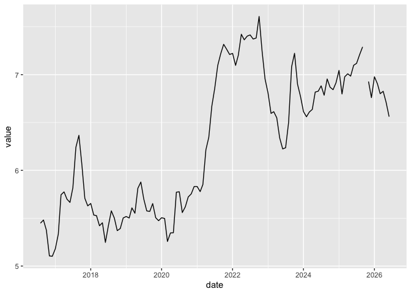

<!-- README.md is generated from README.Rmd. Please edit that file -->

# BLT

<!-- badges: start -->

[](https://github.com/AmeliaMN/BLT/actions/workflows/R-CMD-check.yaml)
[](https://app.codecov.io/gh/AmeliaMN/BLT)
<!-- badges: end -->

The goal of BLT is to provide helper functions for time series data,
particularly data on bacon, lettuce and tomatoes.

## Installation

You can install the development version of BLT from
[GitHub](https://github.com/) with:

``` r
# install.packages("pak")
pak::pak("AmeliaMN/BLT")
```

## Example

This is a basic example which shows you how to solve a common problem:

``` r
library(BLT)
AR1(bacon$value)
#> Series: x 
#> ARIMA(1,0,0) with non-zero mean 
#> 
#> Coefficients:
#>          ar1    mean
#>       0.9720  6.1917
#> s.e.  0.0185  0.4317
#> 
#> sigma^2 = 0.02769:  log likelihood = 43.42
#> AIC=-80.83   AICc=-80.62   BIC=-72.49

bacon |>
  perc_missing_tidy(value)
#> [1] "0.84%"
```

What is special about using `README.Rmd` instead of just `README.md`?
You can include R chunks like so:

``` r
summary(cars)
#>      speed           dist       
#>  Min.   : 4.0   Min.   :  2.00  
#>  1st Qu.:12.0   1st Qu.: 26.00  
#>  Median :15.0   Median : 36.00  
#>  Mean   :15.4   Mean   : 42.98  
#>  3rd Qu.:19.0   3rd Qu.: 56.00  
#>  Max.   :25.0   Max.   :120.00
```

You’ll still need to render `README.Rmd` regularly, to keep `README.md`
up-to-date. `devtools::build_readme()` is handy for this.

You can also embed plots, for example:

    #> Warning: package 'ggplot2' was built under R version 4.4.3



In that case, don’t forget to commit and push the resulting figure
files, so they display on GitHub and CRAN.
