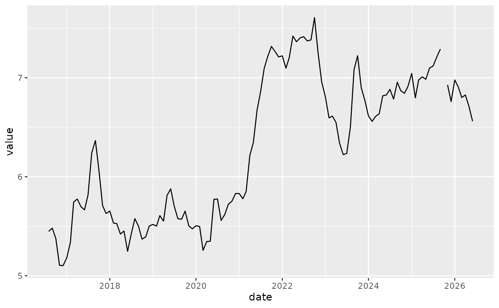

# BLT

The BLT package provides helper functions to work with time series data
on bacon, lettuce, and tomatoes.

``` r

library(BLT)
library(ggplot2)
```

One function is
[`AR1()`](https://ameliamn.github.io/BLT/reference/AR1.md),

``` r

AR1(bacon$value)
#> Series: x 
#> ARIMA(1,0,0) with non-zero mean 
#> 
#> Coefficients:
#>          ar1    mean
#>       0.9720  6.1917
#> s.e.  0.0185  0.4317
#> 
#> sigma^2 = 0.02769:  log likelihood = 43.42
#> AIC=-80.83   AICc=-80.62   BIC=-72.49
AR1(lettuce$value)
#> Series: x 
#> ARIMA(1,0,0) with non-zero mean 
#> 
#> Coefficients:
#>          ar1    mean
#>       0.9556  1.4069
#> s.e.  0.0290  0.1921
#> 
#> sigma^2 = 0.01136:  log likelihood = 61.55
#> AIC=-117.09   AICc=-116.88   BIC=-108.76
```

We also might want to know the percentage of NAs in our time series,

``` r

bacon |> 
  perc_missing_tidy(value)
#> [1] "big dataset"
#> # A tibble: 1 × 1
#>   perc 
#>   <chr>
#> 1 0.84%

lettuce |>
  perc_missing_tidy(value)
#> [1] "big dataset"
#> # A tibble: 1 × 1
#>   perc 
#>   <chr>
#> 1 34.5%

tomatoes |>
  perc_missing_tidy(value)
#> [1] "big dataset"
#> # A tibble: 1 × 1
#>   perc 
#>   <chr>
#> 1 2.52%
```

So, lettuce has the greatest percentage of missing data.

``` r

library(ggplot2)
ggplot(bacon) +
  geom_line(aes(x = date, y = value))
```


